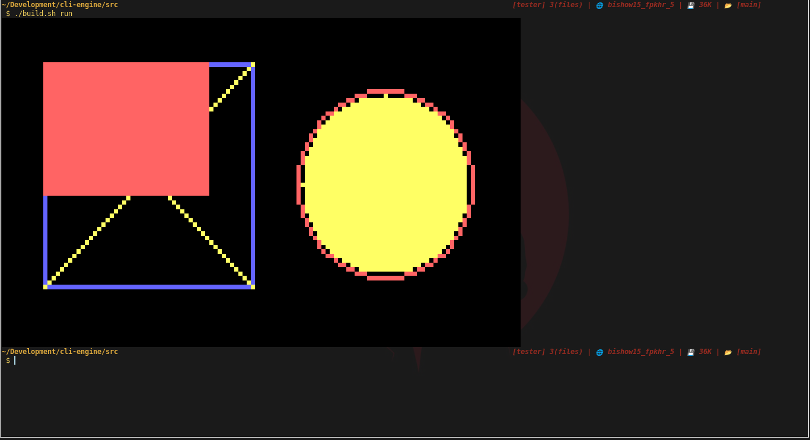
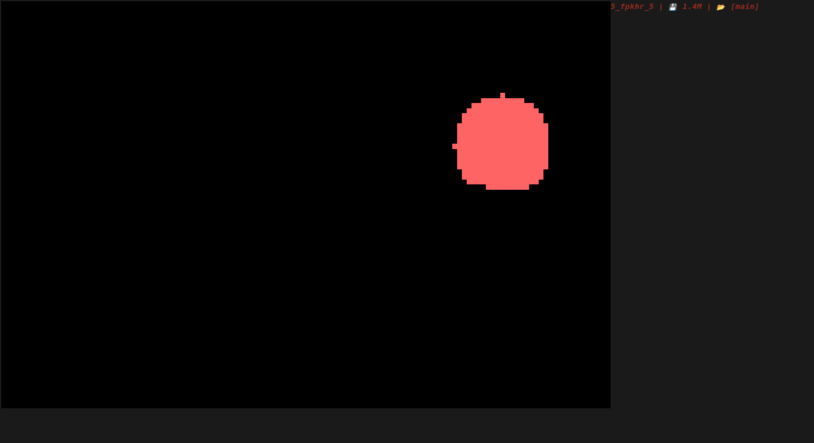

# cli-engine
CLI based game engine, Command Line game engine for 2d (3d may be.) games in terminal.
It uses the [chafa](https://github.com/hpjansson/chafa) style terminal painting or drawing to draw pictures in terminal

# Get Started

```bash
git clone https://github.com/leyuskckiran1510/cli-engine.git
cd cli-engine
make
```


# Snapshots
`2023-Sep-19:21-09-36 PM`

`2023-Sep-21:16-04-02 PM` eventloop and window title


`2023-Sep-22:12-12-48 PM` eventloop and window title

